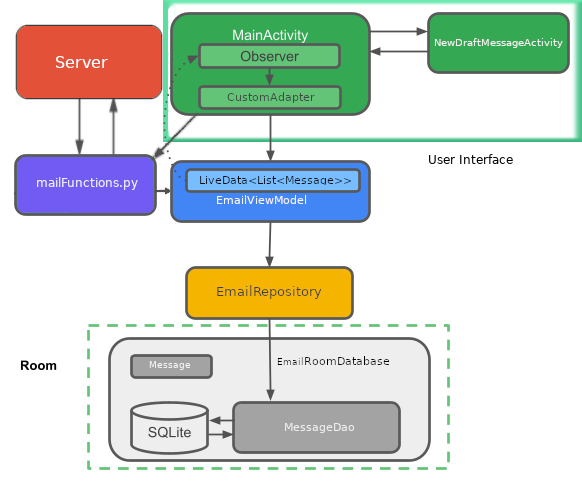

# Maturvortrag Simon
## Warum?
Weshalb wollten wir diese Arbeit machen? 

Da wir beide relativ zukunftsorientiert sind war Informatik schon länger ein Thema das uns interessierte. Ich wollte ursprünglich einen Edubs-Mail-Client programmieren da mich das nicht 
Vorhandensein eines solchen Programms sehr störte und die alternative war die edubswebsite auf dem Homescreen zu verlinken. 
Als ich mit meiner ursprünglichen Idee zu Noah ging, mit dem Gedanken seine Meinung dazu zu erfahren, haben wir uns sehr schnell
darauf geeinigt die Idee weitergesponnen sogar zusammen umzusetzen, weil Noah schon länger auf der Suche nach einem Email-Client für seine Bedürfnisse war und ihm diese chance
selbst einen zu Entwickel ganz gut kam. Also unsere Motivation für dieses Produkt war ein Programm zu Entwickeln, welches unseren Bedürfnissen entspricht. (Bedürfnisse aufschreiben)

## AppStructure

Unsere App hat viele Facetten aber heruntergebrochen könne wir sie so darstellen (auf bild zeigen). Im grossen und ganze können wir sie sogar in drei Teile unterteilen. 
Die Oberfläche, die sie vorhin sahen, ist das User Interface. (beispiele aus dem Video zeigen)

Es kann Informationen aufnehmen die wir eingeben. Zum beispiel eine Email, oder eine Emailadresse um sich anzumelden.
Und Natürlich kann es auch Informationen anzeigen. Informationen aus dem User Interface werden weitergegeben an das EmailViewModel, welches die Verknüpfung von 
den Informationen des Interface und den Servern ist. Denn es kann über ein kleines extra Programm Kontakt zu einem Server aufnehmen aber Noah wird das noch weiter erläutern. Die dort 
gesammelten Informationen werden dann weiter an die Database gegeben die diesen dann abspeichert um sie wieder abrufbar zu mache. 

# Was haben wir gelernt
Wir haben im laufe der Arbeit sehr viel gelernt. 
Zu beginn der Arbeit konnten wir beide noch nicht so recht Java. Heisst wir haben das erstmahl richtig gelernt. Und dann haben wir uns natürlich 
Gedanken zu einer allgemeinen Handyapp machen müssen und gelernt aus welchen Komponenten sie besteht. Zum beispiel war uns Anfangs nicht bewusst, dass das User Interface 
in html geschrieben wird. Wir haben gelernt wie viel Arbeit eine solches Projekt braucht und was eine App ausmacht. Wir haben viel über verschiedene Libraries gelernt. Aber 
das wichtigste war die Handhabung von Github und die Zusammenarbeit von uns beiden. Denn diese hat sehr gut funktioniert. Wir konnten Individuell an einem Projekt über Monate 
arbeiten ohne das es Probleme mit der Arbeit des anderen gab. Wir haben uns vor der Maturarbeit ein wenig eingespielt aber während der Maturarbeit und Strukturen gegeben die uns
massiv geholfen haben. Das fast wöchentliche treffen und absprechen, die diary und Github haben die Zusammenarbeit ermöglicht. Wir haben natürlich auch den Umgang mit AndroidStudio gelernt
oder wie das debugging einer Handyapp funktioniert. Ebenso haben wir etwas über Database und SQL gelernt. 
