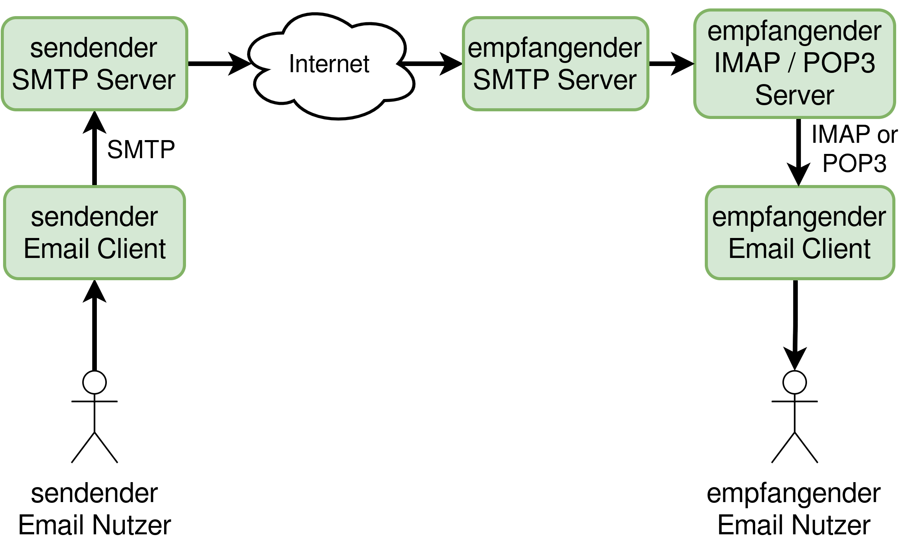

# Maturvortrag 
## Warum? simon
Weshalb wollten wir diese Arbeit machen? 

Da wir beide relativ zukunftsorientiert sind war Informatik schon länger ein Thema das uns interessierte. Ich wollte ursprünglich einen Edubs-Mail-Client programmieren da mich das nicht 
Vorhandensein eines solchen Programms sehr störte und die alternative war die edubswebsite auf dem Homescreen zu verlinken. 
Als ich mit meiner ursprünglichen Idee zu Noah ging, mit dem Gedanken seine Meinung dazu zu erfahren, haben wir uns sehr schnell
darauf geeinigt die Idee weitergesponnen sogar zusammen umzusetzen, weil Noah schon länger auf der Suche nach einem Email-Client für seine Bedürfnisse war und ihm diese chance
selbst einen zu Entwickel ganz gut kam. Also unsere Motivation für dieses Produkt war ein Programm zu Entwickeln, welches unseren Bedürfnissen entspricht. (Bedürfnisse aufschreiben)

## AppStructure simon

Unsere App hat viele Facetten aber heruntergebrochen könne wir sie so darstellen (auf bild zeigen). Im grossen und ganze können wir sie sogar in drei Teile unterteilen. 
Die Oberfläche, die sie vorhin sahen, ist das User Interface. (beispiele aus dem Video zeigen)

Es kann Informationen aufnehmen die wir eingeben. Zum beispiel eine Email, oder eine Emailadresse um sich anzumelden.
Und Natürlich kann es auch Informationen anzeigen. Informationen aus dem User Interface werden weitergegeben an das EmailViewModel, welches die Verknüpfung von 
den Informationen des Interface und den Servern ist. Denn es kann über ein kleines extra Programm Kontakt zu einem Server aufnehmen aber Noah wird das noch weiter erläutern. Die dort 
gesammelten Informationen werden dann weiter an die Database gegeben die diesen dann abspeichert um sie wieder abrufbar zu mache. 

## Was haben wir gelernt simon

Wir haben im laufe der Arbeit sehr viel gelernt. 
Zu beginn der Arbeit konnten wir beide noch nicht so recht Java. Heisst wir haben das erstmahl richtig gelernt. Und dann haben wir uns natürlich 
Gedanken zu einer allgemeinen Handyapp machen müssen und gelernt aus welchen Komponenten sie besteht. Zum beispiel war uns Anfangs nicht bewusst, dass das User Interface 
in html geschrieben wird. Wir haben gelernt wie viel Arbeit eine solches Projekt braucht und was eine App ausmacht. Wir haben viel über verschiedene Libraries gelernt. Aber 
das wichtigste war die Handhabung von Github und die Zusammenarbeit von uns beiden. Denn diese hat sehr gut funktioniert. Wir konnten Individuell an einem Projekt über Monate 
arbeiten ohne das es Probleme mit der Arbeit des anderen gab. Wir haben uns vor der Maturarbeit ein wenig eingespielt aber während der Maturarbeit und Strukturen gegeben die uns
massiv geholfen haben. Das fast wöchentliche treffen und absprechen, die diary und Github haben die Zusammenarbeit ermöglicht. Wir haben natürlich auch den Umgang mit AndroidStudio gelernt
oder wie das debugging einer Handyapp funktioniert. Ebenso haben wir etwas über Database und SQL gelernt. 

## Ziele (was hatten wir vor) noah

Die App soll die Basisfunktionen eines klassischen Email Clients erfüllen. Dazu gehören das Lesen, Schreiben, Empfangen und Versenden von Emails, das Öffnen und Anfügen von Anlagen, die Setzung einer Email-Signatur und das Erstellen und Speichern von Entwurfen.

Ebenso soll es einen Account Manger geben, welcher dem Nutzer ermöglicht, sich in der App mit mehrern Emailkonten anzumelden und zwischen diesen zu wechseln.

Die App soll auch so konzipiert und programmiert sein, dass neue Funktionen und sonstige generelle Änderungen einfach und unkompliziert gemacht werden können. Dazu ist eine möglichst sinnvolle Codestruktur, welche in sich selber nicht wiedersprüchlich ist, vonnöten.

Unsere App hat das Ziel schneller zu starten, als die Alternativen.

Auch die typischen Vorzüge und Funktionalitäten der Mobilplattform Android sollen produktiv verwendet werden. Dazu gehören allem voran die Pushnachrichten. Auch soll möglich sein, dass Links direkt in einem Browser geöffnet werden können.

Auch soll ein Einstellungsfenster erstellt werden, wo der Nutzer verschiedene Verhalten der App anpassen kann. Beispielsweise soll es das Farblayout der App, die Synchronisationsintervalle und Einstellungen an den Pushnachrichten ändern können, Kontaktlisten verwalten und Einstellungen zur Privatsphäre beinhalten.

## Was haben wir wirklich selber gemacht noah

Wir haben natürlich von Softwarebibliotheken (engl. libraries) Gebrauch gemacht. Dazu gehören die Standardbibliotheken von Android, welche jede App verwenden muss, aber auch spezielle Sachen für unsere App. 

### Database (mit dem bini nonig zfriede... material isch besser geeignet für das I think) noah

Dazu gehören z.B. Room, SQLite welche verwendet werden, um eine Datenbank zu erstellen und mit einer gewissen Abstrahation diese zu bearbeiten. Das bedeutet, dass wir zwar eine eigene Datenbankstrukur erstellt haben, welche Emails speichern, abrufen und für mehrere Accounts genutzt werden kann, und diese selber geschrieben haben, so haben wir aber immer noch nicht eine SQL Datenbank selber geschrieben.

### GUI -> Material Design noah

Das dahinterliegende Framework welches den App Entwicklern ermöglicht, Fenster, Knöpfe, Texte und Texteingabefelder ermöglicht, ist schon von Android gegeben. Da dieses GUI-Framework aber visuell nicht wirklich ansprechend ist, benutzen wir die Bibliothek *Material*. Diese Bibliothek ändert ein paar Standard Styles und Designs, und wird bereits in einigen viel genutzten Apps benutzt, was dem neuen Nutzer eine familiäre Benutzererfahrung beschert.

Es ist also wie eine Art Lego mit verschiedenen vorgefertigten Bauwerken, welche man kopieren kann und daraus eine Spielzeugsiedlung nach seinem Anspruch bauen kann. Naja, besser angebracht wäre eher von einer hochkomplexen, industriellen Gesellschaft zu sprechen als von einer Siedlung.

## Database noah

Eine Datenbank (engl. database) ist allgemein eine organisierte Ansammlung von strukturierter Information oder Daten, typischerweise digital auf einem Computersystem gespeichert, verwaltet und ausgewertet (nach [oracle](https://www.oracle.com/database/what-is-database/). Diese ist oft sehr ähnlich aufgebaut wie die für Endnutzer entwickelten graphischen Tabellenkalkulationsprogramme wie z.B. Libre Office, Google Docs oder Only Office.

Eine standardisierte Form um Datenbankabfragen zu machen ist *SQL*, ausgeschrieben *Structured Query Language*. Diese haben wir auch verwendet in unserer App.

## Warum Java noah
*Java* war seit langem die offizielle Programmiersprache für die Android App Entwicklung. Seit 2019 wurde die von Google entwickelte Sprache *Kotlin* als offizielle Sprache deklariert, da Google die Hauptprogammiersprache für ihr Android Projekt selbst kontrollieren wollten. Kotlin ist sehr ähnlich aufgebaut wie Java und hat verschiedene Vor- und Nachteile. Da wir aber schon im Ergänzungsfach Informatik hier am GKG Java benutzt und kennengelernt haben, sahen wir dies als Opportunität, unsere bisherigen Java-Kenntnisse einbringen zu können und diese weiterzubringen.

## Was schlecht lief noah
Da wir noch nie in der Androidentwicklungsumgebung gearbeitet haben, war uns klar, dass wir noch keine Bibliotheken kennen und diese erst noch suchen und finden müssen, sofern wir dieser brauchen. Während das bei den meisten Bibliotheken kein Problem war, stiessen wir nach gründlicher Suche auf keine mit Gradle funktionierende, ausreichend dokumentierte und/oder nicht veraltete Email Bibliotheken für Java.

Als Notlösung mussten wir dann auf die mir bereits bekannte Python Bibliotheken zurückgreifen, doch dazu mussten wir erst mal einen Weg finden, Python Code in ein Java Programm einzubinden. Das ist natürlich eine unschöne Zwischenlösung, aber die Funktionalität hatte schliesslich oberste Priorität gehabt.

## Server Connection noah

Vereinfacht funktioniert der Versand von Emails in diesem Diagramm: Ein Nutzer, der eine Email versenden will, interagiert mit seinem Mail-Client und gibt durch ihn den Befehl, die Email zu versenden. Der Email Client verschickt die Mail an den SMTP Server des sendenden Nutzers, wo dieser zum SMTP Server des empfangenden Nutzers gelangt, von dort aus zu seinem IMAP oder POP3 Server. Wenn der Mail Client des Empfängers eine Anfrage an seinen SMTP / POP 3 macht, kann er diese einlesen und der Nutzer kann nun seine neue Email lesen.

## Inspiration Design noah
Wir haben uns die verschiedenen Email Client auf Android angeschaut und viel gutes und schlechtes gesehen. Es scheint als seien diese aus 70% guten und 30% schlechten Sachen zusammengesetzt. Wenn man diese verschiedenen Designprinzipien kombiniert, könnte man eine aus unseren Augen ziemlich passable Email App erschaffen. So gefiel uns das responsive und für die Mobilnutzung ziemlich ausgeklügelte Touch Interface bei Gmail, doch fanden wir es unnötig überladen und langsam. Während k9-mail eine schnelle UI (User Interface) bietet, so empfanden wir die grafische Oberfläche als sehr undurchdacht konzipiert. Bei Fairmail war das Interface dermassen überladen, dass wir gar nicht weiter nach anderen, möglichen Vorteilen gesucht haben.

## Resultate: Vergleich mit ursprünglichen Zielen noah
Das User Interface ist erfreulich gut im Einklang mit den ursprünglichen Zielen; es ist wirklich einfach ohne irgendwelchen unnötigen Schnickschnack. Um die Nutzerfreundlichkeit zu testen, haben wir Freunde und Bekannte eingespannt, damit diese die App testen. Dabei haben sie sich noch ziemlich gut zurechtgefunden, wenn man bedenkt, dass die App ja noch nicht fertig programmiert ist.

Unsere App sollte ja *Free Software* werden, inklusive Bibliotheken. Doch da wir uns noch nicht so gut auskannten mit Gradle, schlich sich eine nichtfreie Library namen *chaquopy* ein. Diese ist zuständig für die Einbindung von Python Code in Java. Diese hatten wir aber in Zukunft sowieso schon geplant loszuwerden, da wir aus Performacegründen die Pythoneinbindung beenden wollten.

Die wichtigsten Funktionen der App wurden erreicht, es können Emails geschrieben, gelesen werden, es bestehen verschiedene Mailboxen und jeder kann seine Email Accounts gut managen, also hinzufügen, ändern und entfernen. Gewisse Features, wie Pushnachrichten, Suchfunktionen, ein visuelles Attribut, wo zu sehen ist, ob eine Nachricht gelesen wurde, fehlen noch ganz. Funktionen wie die Einstellungen, das synchronisieren der Datenbank mit dem Mailserver und die Anhangs-Funktionalität sind noch nicht fertiggestellt. Diese stellen aber soweit kein absehbare Schwierigkeiten dar bei der Weiterentwicklung.

Insgesamt haben wir also doch das meiste und wichtige erreichen können, was ein Emailclient auf einem Smartphone so haben muss. Das motiviert uns natürlich für die weitere Entwicklung und Vollendung des Projekts *snailmail*.
